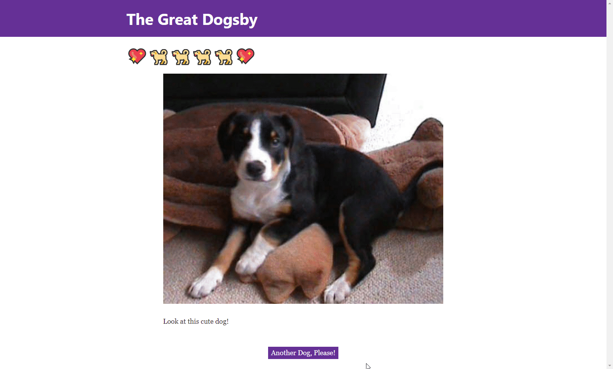

# MWI Homework Exercises

Below you will find several exercises. Each was lovingly handcrafted by one of our developers to take 1-2 hours to complete. We ask that you select one, implement a solution, and send us a link to the repository with the completed solution within 24 hours. The purpose of this exercise is give you an opportunity to demonstrate your ability to deliver a result in a timely fashion. If you submit a working solution to one of the exercises we will schedule a final onsite interview. The quality of the code will not be taken into consideration, however you will be asked to explain it to us during your next interview.

For exercises that require working with files, you can find example inputs and outputs in this repository. These files will be in a directory named after the exercise.

## ACH Find Invalid Characters

ACH files are used to transfer between banks. It is a fairly old specification so it cannot handle modern unicode characters. In fact, it can only handle _alphameric_ (a-z A-Z0-9_-:.@$=/ ) characters. In this exercise you will create a program that will search for and point of invalid characters in an ACH file.

### Requirements

* Create a console application or script that takes a single parameter that is the path to the file to search for invalid characters.
* If you find a character that is not alphameric, print the character and the position in the file on screen.

### Resources

* [How ACH Works, A Developer's Perspective](https://engineering.gusto.com/how-ach-works-a-developer-perspective-part-4/)
* Example files:
  * invalid-chars.ach: an ACH file that contains invalid characters

## ACH Toggle

ACH is a fixed width file format. Each record is 94 characters long. In order to improve human readability it can be helpful to put line breaks at the end of each record. Make an application that can toggle (insert or remove) line endings in an ACH file.

### Requirements

* Create a console application or script that takes a single parameter that is the path to the file to toggle line ends on.

### Resources

* [How ACH Works, A Developer's Perspective](https://engineering.gusto.com/how-ach-works-a-developer-perspective-part-4/)
* Example files:
  * add_line_breaks.ach: example file that does not contain any line breaks
  * remove_line_breaks.ach: example file that contains line breaks


## Consume A Basic Web API

Make a simple command line interface to interact with The Dog API

### Requirements

* There is a command to request and print all dog breeds to the console
* There is a command to download and save a random dog image, which then tells the user where the image was saved

### Bonus

* Format output for breed lists in a way that is prettier than JSON. Maybe one breed/sub-breed per line.
* There is a command that will prompt the user to enter the name of a breed and then request and print a list of that breed's sub-breeds
* There is a command that will prompt the user to enter the name of a breed and download and save an image of that breed
* Whenever downloading images, open the image in the user's preferred image viewer in addition to saving it

### Resources

* The [Json.NET](https://www.newtonsoft.com/json) library may be useful for parsing JSON responses if you choose to use C#/.NET
* [The Dog API](https://dog.ceo/dog-api/)


## CSV Duplicate Record Remover

A comma-separated values (CSV) file is a delimited text file that stores tabular data using the comma (',') character to separate plain text column (field) values, with each data record (row) separated by new line characters. This exercise entails making a console application that reads in a CSV file, finds duplicate entries, and writes the unique entries to a new CSV file.

### Requirements

* Read in a CSV file
* Make all the rows in the CSV unique
* Write the data back out to another CSV file
* The data in the resulting file should contain all of the unique entries in the file that was read in, without the duplicates

### Resources

* [CSV Wikipedia Article](https://en.wikipedia.org/wiki/Comma-separated_values)
* Example files:
  * DuplicateRemoverSampleInput.csv: a CSV file that contains duplicate records


## CSV to Fixed Width

A comma-separated values (CSV) file is a delimited text file that stores tabular data using the comma (',') character to separate plain text column (field) values, with each data record (row) separated by new line characters. A fixed length file, in contrast, does not use a delimiter such as a comma to separate field values, but instead makes each field value for a given column across all records a fixed length by appending or prepending a padding character such as a whitespace, so that when viewed each column of data is vertically aligned.

### Requirements

* Produce a command line application which will take a Comma-Separated Value (CSV) file, then write out the values from that file into a fixed length format file.
* Make each field in the fixed width file 9 characters long, left aligned

### Example

```
$ yourappname /path/to/input.csv /path/to/output/file
```


Note that the pipes shown on the right are for illustration only, and should not be in your output file.

### Resources

* [CSV Wikipedia Article](https://en.wikipedia.org/wiki/Comma-separated_values)
* Example files:
  * input-example.csv: a csv file
  * output-example: expected output based on input-example.csv

## CSV File Editor

A comma-separated values (CSV) file is a delimited text file that stores tabular data using the comma (',') character to separate plain text column (field) values, with each data record (row) separated by new line characters. CSV files also commonly have a header that denotes the meanings and order of the values. CSV files are a common file format for transferring payment information. It is also common to manipulate the data in a given CSV file to match a new format. In this exercise you will write a console application to read in a CSV file, manipulate some of the data from that file (listed in the requirements), and then write the new data to a new CSV file.

### Requirements

* Create a console application that takes a single parameter that is the path to the CSV file
  * Below is the header and a couple lines from the CSV file to be read in:

```
AccountNumber,LoanId,LastName,FirstName,AmountDue,DateDue,SocialLastFour
100000,001,Snow,John,10000,20170715,1234
100000,002,Snow,Victor,20000,20170715,1234
```

* After reading in the CSV file, make the following modifications to each record of imported data:
  * Take the LastName and FirstName field and concatenate them into one field with a space between FistName and LastName
  * Convert the AmountDue field from cents to dollars and format the field as Currency
* Write the new data into a new CSV file with a new name in the same path as the imported CSV file
  * Below is an example of what the output of the CSV file should look like

```
AccountNumber,LoanId,Name,AmountDue,DateDue,SocialLastFour
100000,001,John Snow,$100.00,20170715,1234
100000,002,Victor Snow,$200.00,20170715,1234
```

### Resources

* [CSV Wikipedia Article](https://en.wikipedia.org/wiki/Comma-separated_values)
* Example files:
  * InputBankFile.csv: an example file contain account balances
  * OutputBankFile.csv: the result of running the program with InputBankFile.csv

## The Great Dogsby

Using The Dog API and either [create-react-app](https://github.com/facebook/create-react-app) or [gatsby](https://www.gatsbyjs.org/), make a simple React application with the following:

### Requirements

* A random image of a dog is displayed when the page is loaded
* A button that when clicked replaces the current image with a new dog image without reloading the page

### Bonus

* Center The Image and the button using CSS Grid
* Using CSS, give the button a flat color
* Using CSS, make every image take up the same amount of vertical space (the button shouldn't jump around as you request more dogs)
* Use Semantic HTML when structuring your page

### Visual Example



### Resources

* https://dog.ceo/dog-api/
* https://github.com/facebook/create-react-app
* https://www.gatsbyjs.org/


## ReactJs Clock

Make a clock component using React that shows the current date and time.

### Requirements

* The time should be stored in the component's state

### Bonus

* Put a picture of a calendar next to the date, and a picture of a clock next to the time
* Allow the user to switch between 12-hour and 24-hour time


## Web Scraping

XKCD is a popular comic with a fairly consistent web page layout, which makes it a good candidate for an application that traverses their comic archive. If you wanted to index all of the existing comics manually, it would take ages, but with some way to read the HTML response to find the information we care about, along with the "next" button's link, we should be able to catalog them pretty quickly.

### Requirements

* Create a console application or scripts that pulls content from XKCD, reads specific information from the page, and moves to the next page.
  * Comic Number
  * Comic Title
  * Image Hover Text
  * Image Link
* Walk through all xkdc comic pages
* Grab useful information (comic number, comic title, alt text, image link) from each page

### Bonus

* Handle the change in output around comic 1100

### Example Output:

```
Comic Number: "1"
Comic Title: "Barrel - Part 1"
Hover Text:  "Don't we all."
Image Link: "imgs.xkcd.com/comics/barrel_cropped_(1).jpg"
```

### Resources

* https://xkcd.com/1/
